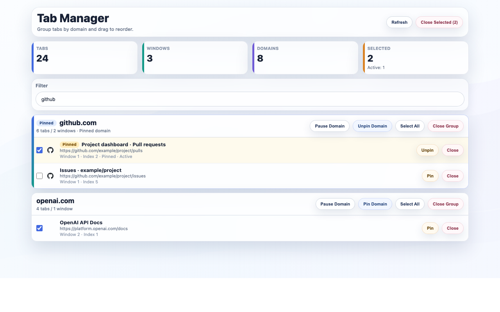
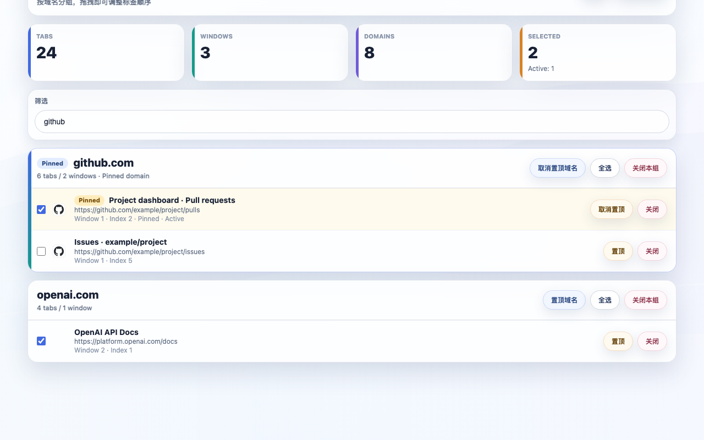

# Tab Organizer

<a href="#chinese">中文</a>

## English Description

Tab Organizer is a Chrome Manifest V3 extension that helps prevent duplicate tabs, organize tabs by domain, and manage all tabs in a visual dashboard.

### Key Features

- Duplicate prevention: detects identical links and starts a merge flow.
- Confirm-before-merge: duplicate tabs can be reviewed before merge or keep.
- Domain grouping: keeps tabs from the same domain together.
- Domain split window: when a domain exceeds the threshold, tabs can be moved into a dedicated window.
- Domain filtering: supports all / exclude / include modes with wildcard, regex, and path rules.
- Domain pause: temporarily pause auto-processing for a domain, then resume later.
- Manager page: grouped view, collapse or expand, rename domain cards, pin domain, focus tab, drag reorder, multi-close, group close, and undo close.
- Shortcut: open the Manager page with `Command+Shift+Y` on macOS or `Ctrl+Shift+Y` on other systems. The shortcut can be changed in Chrome's extension shortcuts page.
- Selection productivity: Shift range selection and Ctrl/Cmd+A for current filtered results.
- Bilingual UI: both Popup and Manager support Chinese and English with shared language preference.

### Processing Order

1. Duplicate detection or pending review  
2. Domain routing to a dedicated window  
3. Domain sorting in the current window  
4. Threshold-based split window

### Install Guide

1. Open `chrome://extensions/`.  
2. Turn on `Developer mode`.  
3. Click `Load unpacked`.  
4. Select the project `chrome/` folder.  
5. After installation, Tab Organizer will appear in your extensions list.
6. Optional: open `chrome://extensions/shortcuts` to customize the Manager shortcut.

### Screenshots

---

## 中文说明

Tab Organizer 是一个 Chrome Manifest V3 扩展，用于减少重复标签页、按域名整理标签页，并提供可视化管理页。

### 核心能力

- 防重复标签页：识别相同链接并触发合并流程。
- 合并前确认：重复页可先进入待确认列表，由用户决定合并或保留。
- 域名排序：将相同域名标签页自动聚拢，保持更清晰的浏览顺序。
- 域名拆窗：当同域名标签页超过阈值时，自动归并到专属窗口。
- 域名过滤：支持全量处理、排除域名、仅处理指定域名，含通配符、正则和路径规则。
- 域名暂停处理：可按域名临时暂停自动处理若干分钟，并支持恢复。
- 管理页操作：按域名分组查看、折叠或展开、重命名域名卡片、置顶域名、跳转标签页、拖拽排序、多选关闭、整组关闭、撤销关闭。
- 快捷键：macOS 默认 `Command+Shift+Y` 打开管理页，其他系统默认 `Ctrl+Shift+Y`，可在 Chrome 扩展快捷键页面修改。
- 多选增强：支持 Shift 连选与 Ctrl/Cmd+A 全选当前筛选结果。
- 中英文切换：Popup 与 Manager 均支持中英文，并共享语言偏好。

### 执行顺序

1. 去重检测或进入待确认  
2. 域名路由到专属窗口  
3. 同窗口域名排序  
4. 超阈值拆窗

### 安装教程

1. 打开 `chrome://extensions/`。  
2. 打开右上角的 `开发者模式`。  
3. 点击 `加载已解压的扩展程序`。  
4. 选择本项目 `chrome/` 目录。  
5. 安装后，Tab Organizer 会出现在扩展列表里。
6. 可选：打开 `chrome://extensions/shortcuts` 自定义管理页快捷键。

### 页面预览

