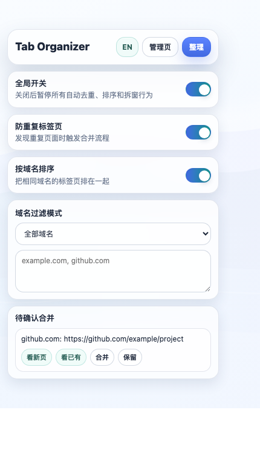
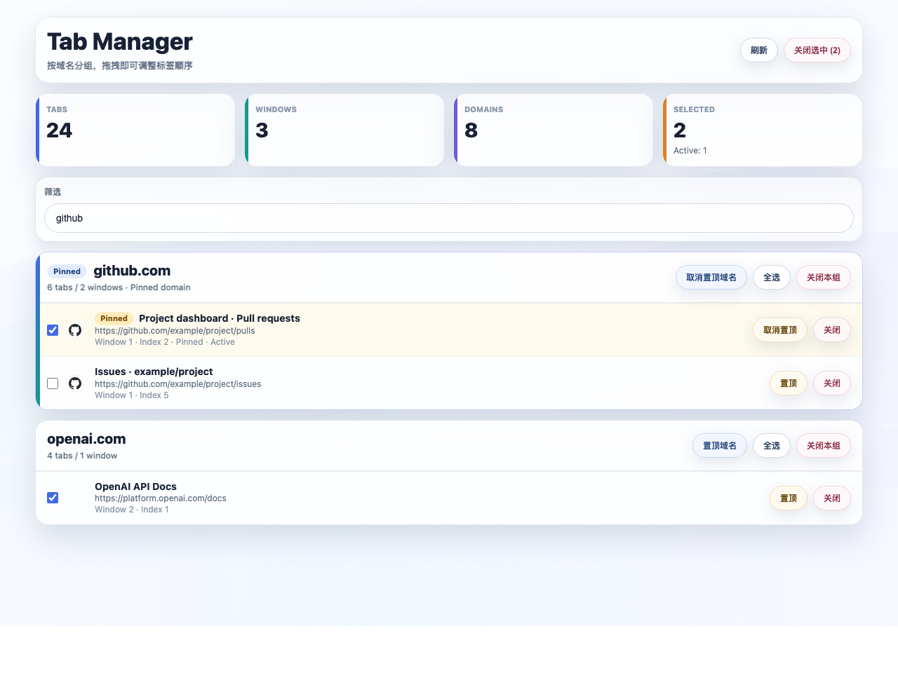

# Tab Organizer

Tab Organizer 是一个 Chrome Manifest V3 扩展，用来减少重复标签页、按域名整理标签页，并提供一个可视化管理页。

它适合经常打开很多资料页、代码页、文档页的人：重复页先确认再合并，同域名标签页自动靠近，域名过多时可拆到独立窗口，管理页里可以按域名批量查看、置顶、关闭和拖拽调整。

## Screenshots

### Popup



### Manager



## Features

- 全局开关：一键暂停或恢复全部自动行为。
- 子开关联动：关闭任意子功能后，全局开关会自动取消；打开全局开关会打开全部子功能。
- 防重复标签页：发现相同页面时进入合并流程。
- 合并前确认：重复页可以先进入待确认列表，由用户选择合并或保留。
- 域名偏好记忆：可对某个域名设置“总是合并”或“总是保留”。
- URL 规范化：支持忽略 hash、忽略常见追踪参数，例如 `utm_*`、`gclid`、`fbclid`。
- 域名过滤：支持全部域名、排除指定域名、仅处理指定域名。
- 过滤规则增强：支持通配符、正则、域名加路径规则，例如 `*.example.com`、`/docs\.site/`、`example.com/docs/*`。
- 按域名排序：把同一窗口里相同域名的标签页排在一起。
- 新域名顺序稳定：新打开的域名不会因为字母排序被插到中间。
- 超阈值自动拆窗：单一域名标签页超过阈值时，可自动拆到独立窗口。
- Manager 管理页：
  - 按域名分组展示所有标签页
  - 查看 Tabs、Windows、Domains、Selected 概要
  - 点击行跳转到指定标签页
  - 拖拽调整同窗口内标签顺序
  - 多选关闭、按域名整组关闭
  - 关闭后可撤销恢复
  - 单个标签页置顶或取消置顶
  - 整个域名卡片置顶或取消置顶
  - 切回 Manager 页时自动刷新
- Popup 快捷页：
  - 快速开关功能
  - 手动整理当前窗口
  - 查看待确认合并列表
  - 中英文切换，并持久保存语言偏好

## Local Install

1. 打开 `chrome://extensions/`。
2. 打开右上角的 `开发者模式`。
3. 点击 `加载已解压的扩展程序`。
4. 选择本目录：

```text
/Users/zxa/Desktop/zxa/AI/chrome
```

如果修改了代码，需要在 `chrome://extensions/` 里点击该扩展的 `重新加载`。

## Files

```text
manifest.json          Chrome 扩展配置
background.js          去重、排序、拆窗、消息处理
popup.html             快捷弹窗页面
popup.css              快捷弹窗样式
popup.js               快捷弹窗逻辑和中英文切换
manager.html           标签页管理页面
manager.css            管理页样式
manager.js             管理页逻辑
assets/manager-bg.svg  背景图
icons/                 扩展图标
docs/screenshots/      README 截图
dist/                  Chrome Web Store 上传包
```

## Chrome Web Store 发布说明

### 1. 准备发布包

本项目已经准备了 Chrome Web Store 上传包：

```text
dist/tab-organizer-1.0.0.zip
```

如果后续改了代码，可以重新打包：

```bash
zip -r dist/tab-organizer-1.0.0.zip \
  manifest.json background.js popup.html popup.css popup.js \
  manager.html manager.css manager.js assets icons
```

### 2. 注册开发者账号

打开 Chrome Web Store Developer Dashboard：

```text
https://chrome.google.com/webstore/devconsole
```

首次发布需要注册开发者账号。Google 通常会要求登录 Google 账号、接受协议，并支付一次性开发者注册费用。

### 3. 创建新商品

1. 进入 Developer Dashboard。
2. 点击 `New item`。
3. 上传 `dist/tab-organizer-1.0.0.zip`。
4. 等待 Google 扫描包内容。

### 4. 填写商店信息

建议填写：

- Extension name: `Tab Organizer`
- Summary: `Avoid duplicate tabs, organize tabs by domain, and manage all tabs in one clean dashboard.`
- Description: 可以使用 README 的 Features 部分改写。
- Category: `Productivity`
- Language: `Chinese (Simplified)` 或 `English`，按目标用户选择。
- Icon: 使用 `icons/icon-128.png`
- Screenshots: 使用：
  - `docs/screenshots/popup.png`
  - `docs/screenshots/manager.png`

### 5. 隐私和权限说明

当前权限：

```json
["tabs", "storage", "sessions"]
```

建议说明：

- `tabs`: 用于读取、定位、关闭、移动、置顶标签页。
- `storage`: 用于保存用户设置、语言偏好、域名置顶和合并偏好。
- `sessions`: 用于恢复刚关闭的标签页，实现撤销关闭。

本扩展不需要服务器，不上传用户标签页数据，所有设置和偏好保存在本地 Chrome 存储中。

### 6. 提交审核

完成商店资料、隐私声明、权限说明后，点击提交审核。审核通过后即可公开或按你选择的发布范围上线。

## GitHub 上传说明

如果本地已经有 GitHub 仓库：

```bash
git init
git add .
git commit -m "Initial Tab Organizer extension"
git branch -M main
git remote add origin git@github.com:<your-user>/<your-repo>.git
git push -u origin main
```

如果使用 GitHub CLI：

```bash
gh repo create tab-organizer --public --source=. --remote=origin --push
```

当前机器没有检测到 `gh` 命令，且 GitHub App 暂未看到可写仓库，所以需要先创建一个仓库或提供目标仓库地址。

## Notes

- `chrome://`、`edge://` 等浏览器内置页面不会被去重或排序。
- 已固定标签页会保留在靠前位置。
- Manager 页里的域名置顶是管理页展示顺序，不会改变浏览器真实窗口顺序。
- 单个标签页置顶会调用 Chrome 原生 pinned tab 能力，会改变真实浏览器标签状态。
